# Keeb journal of development process (as a complete beginner) - 38 hours total

## Section 1: Brainstorming (1 hour)

I first planned my layout for my approximately 60% split keyboard with two Raspberry Pi Picos. I was inspired by keyboards I saw online and wanted to include a trackball and an OLED screen, but later I gave up on the idea as I was a beginner who was already overwhelmed by this project.
I experimented with two different thumb clusters and decided eventually on the row shown in the left sketch.

| | |
| --- | --- |
| 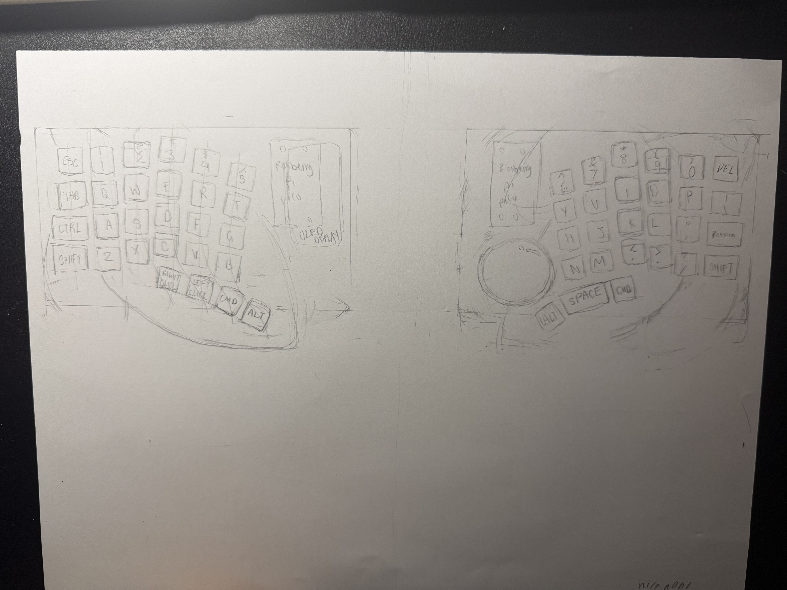 | 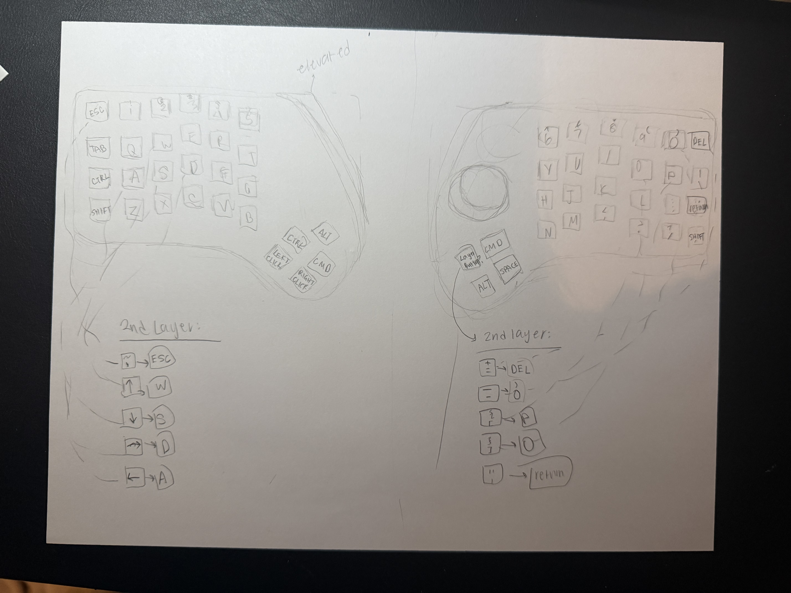 |

## Section 2: Making the schematic (3 hours)
This took such a long time for something that is pretty simple. I was completely new to KiCad and didn't get the workflow from schematic to PCB editor, which came back 
to bite later. I thought that I had to arrange the switches and diodes in the schematic according to the physical layout of my keys. After finally watching a tutorial, I managed
to finish the schematic and route it the Pico. 

A big mistake I made was putting the left and right sides of my keyboard in the same project.
I thought I could use mouse bites to merge them into one PCB, but that ended in failure and I spent a very long time after trying to move the right keyboard into another project
(I had to redo the whole right side basically).

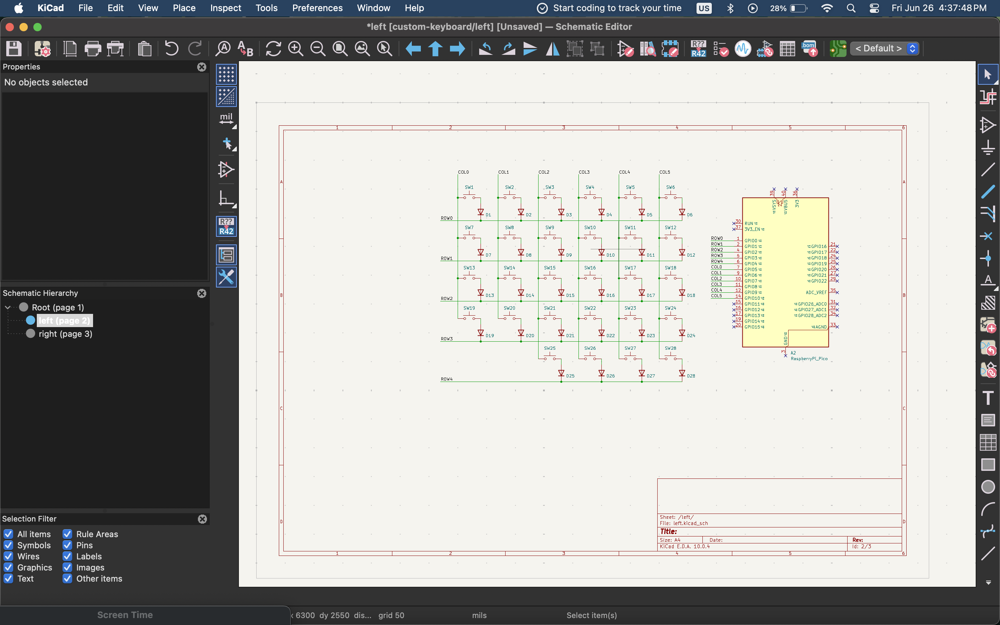
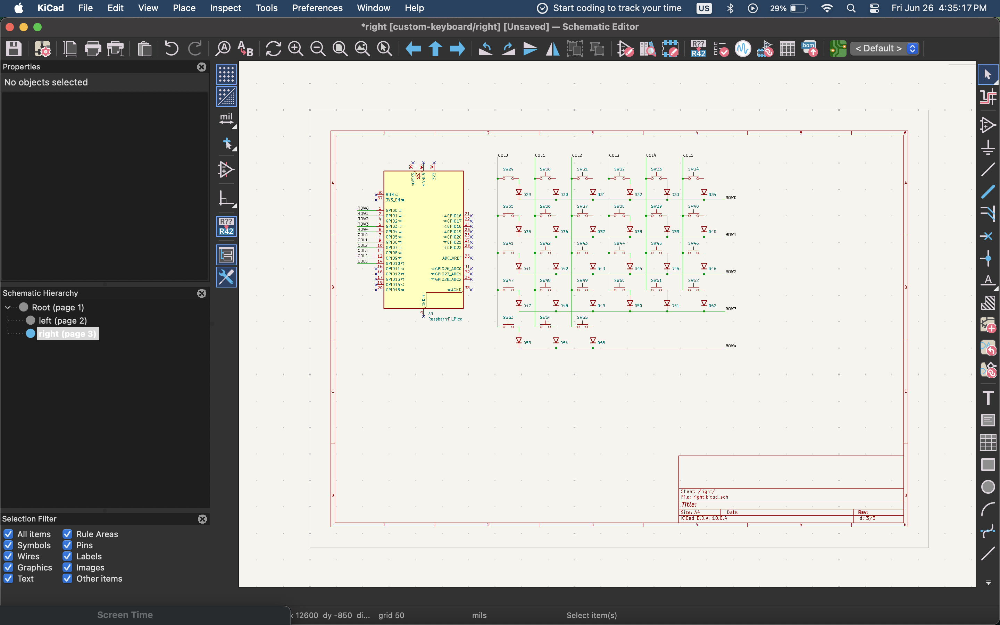

This is not the final version of the schematic. I had to make a few changes when it came to putting the RJ45 socket.

## Section 3: Making the PCB - the hardest part (10 hours: 6 hours for making the PCB and 4 hours for the errors)
Every step of the PCB process was filled with obstacles that I had to overcome. 

I first arranged the switches into my desired layout, but the switches weren't aligning perfectly with just Shift+M, and it took me a couple of Google Searches to discover Shift+G.
Even then, it was still difficult to get the perfect spacing since I had to rotate the column of switches first and then move them next the previous column, and Shift+G didn't really help with that since once rotated, the switches didn't align with the grid.

 

I put the diodes next to the switches (Shift+G was very useful for this) as well as the Raspberry Pi Pico.

 

The process for the edge cuts was painstakingly long because of my key layout. I experimented with different shapes but eventually just decided to follow the shape of the switches.
Also, I know now that the Raspberry Pi Pico position is wrong, I later fixed it so the pink USB Cable area was outside the edge cut.

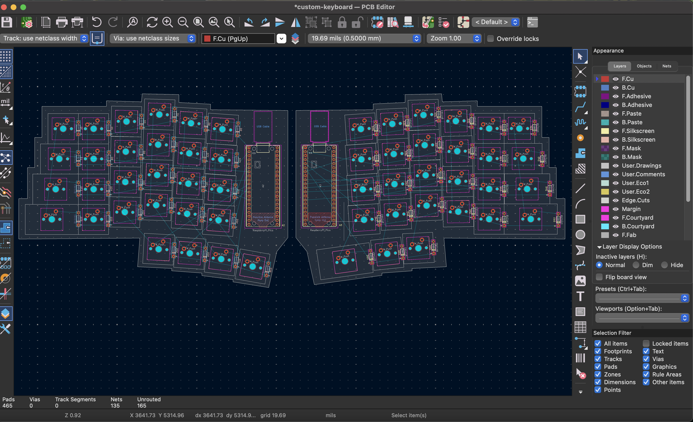
 

I added mouse bites to connect the sides, which ended up causing a lot of errors and not being used in the final version.

 

Routing was surprisingly fun and satisfying to do, even though I had to redo all of them later.

 
 

Ground filling was pretty tedious because I had to match the border to my complicated edge cut.
I also had a lot of errors related to this because of isolated copper islands.

I'm not sure if this was just an issue I was too inexperienced to fix, but I couldn't ground fill with the schematic symbol that 
the Keeb docs recommended because not all the GPIO pins were shown. I tried to modify the symbol, but eventually I just found a new
symbol off of Github that had all the pins.

 

I wish I took a screenshot at the time, but when it came to running the DRC, I had so many errors (186 to be exact) and many more warnings.
It took many KiCad forum and Reddit rabbitholes to fix these errors (thermal spokes, Gnd zones, unconnected tracks).

The achievement I'm most proud of in this whole project: having no errors!
(warnings were all related to silkscreen due to positioning of Pico and mounting holes, which I didn't want to move)
|Left DRC|Right DRC|
| --- | --- |
|  |  |

This was also the time I realized my big mistake of not making two separate projects for the left and right PCBs.
I had to make many backup versions and restart KiCad a lot to somehow separate the two PCBs without losing all my progress.
Unfortunately, when I redid my schematic editor and updated my PCB in the PCB editor, the whole layout was lost and I basically had to redo it (you will see that redoing things will be a continuity throughout the development of this keyboard).

## Section 4: Making the PCB Part 2 - Connecting the PCBs (6 hours: 1.5 hours for research and 4.5 hours for editing the PCB and schematic)

Most split keyboards used a TRRS cable to connect the two sides, and I was going to use that too until I discovered that if you
unplugged a TRRS cable accidentally while the keyboard is connected to the computer (hot plugging), you could severely damage the microcontroller.
Knowing me, I would definitely accidentally unplug the cable, so I opted for an RJ45 even though it made my 3D case a big uglier.

It took me a while to figure out how to route the RJ45, and because specific GPIO pins supported Tx and Rx, I had to move some of my columns and rows around in the schematic,
resulting in having to redo all the routing.

|left RJ45|right RJ45|
| --- | --- |
|  |  |
 
I wanted to thank and credit MagoSaronno (https://github.com/MagoSaronno) who made the Keyther (https://github.com/MagoSaronno/keyther). It was really helpful seeing a public project that used the same socket, RJ45, that I wanted to use.

---

### Final version of schematics:

### Final versions of PCB:
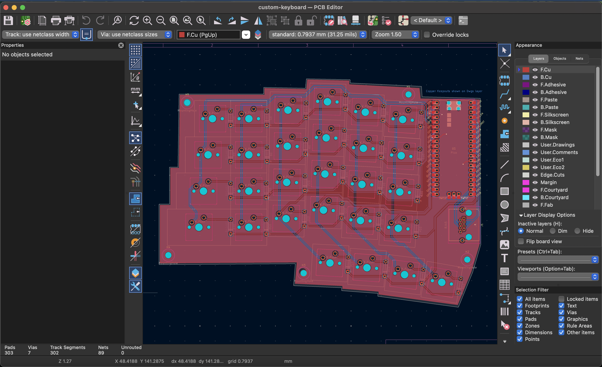
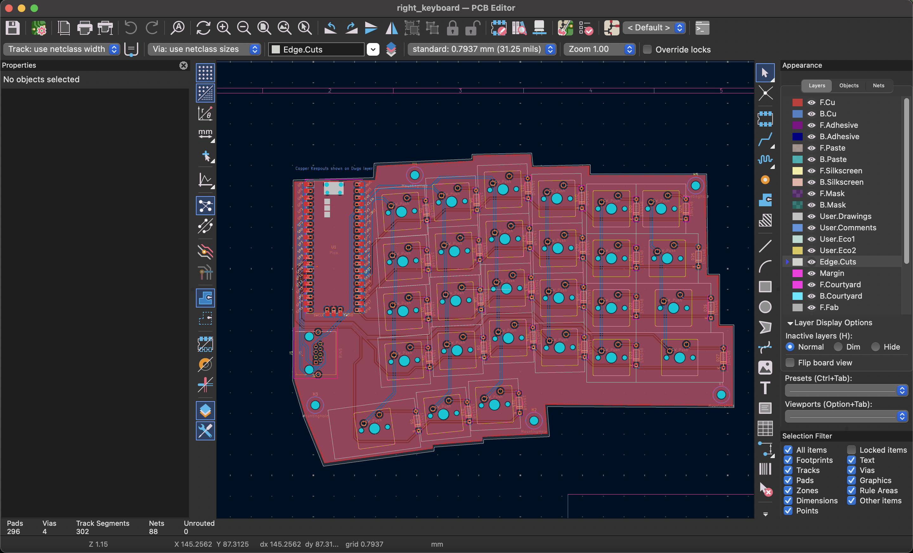

### 3D view of PCB:
|left view|right view|
| --- | --- | 
|  |  |

## Section 5: Designing the case on Onshape (11 hours: 8 hours for the right, 3 hours for the left)
Similar to using KiCad, I went through a lot of trial and error when designing my case on Onshape. I started with the right side, which is why they took much longer than the left.
My sketches at the beginning were a mess and I had to redo them many times. Here is my final sketch, which still looks pretty complicated because of the complex shape.

 

I also had issues with importing my PCB and the attached 3D models because there were too many parts. I had to manually delete most of the parts so Onshape wouldn't take a minute to load every edit I made.

 

The right case with the base and plate done:
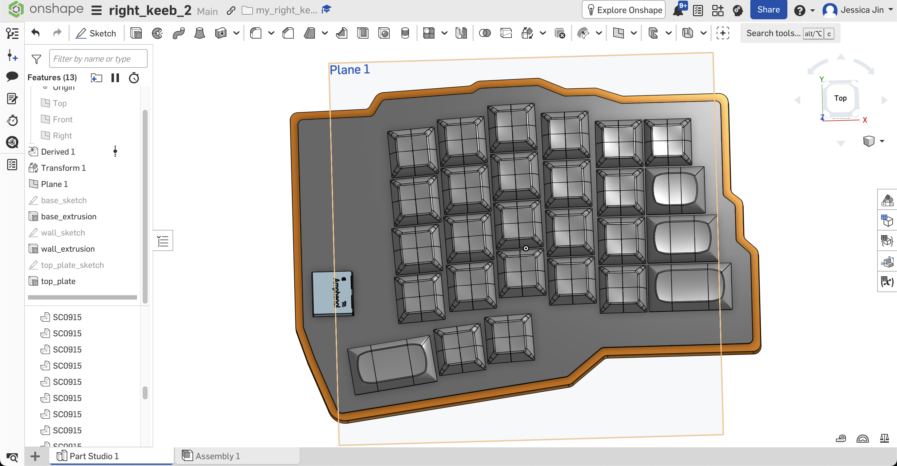
 
I did have to make a few changes to the width of the walls later to accommodate for the screws needed for my mounting style (top mounting).

The left side was so much easier because I had ironed out all of the difficult parts when developing the right case. I was also much more experienced with using Onshape, and that sped up the process even more.
|base sketch|PCB after deleting parts|
| --- | --- |
|  |  |
 

The left case with the base and plate done:
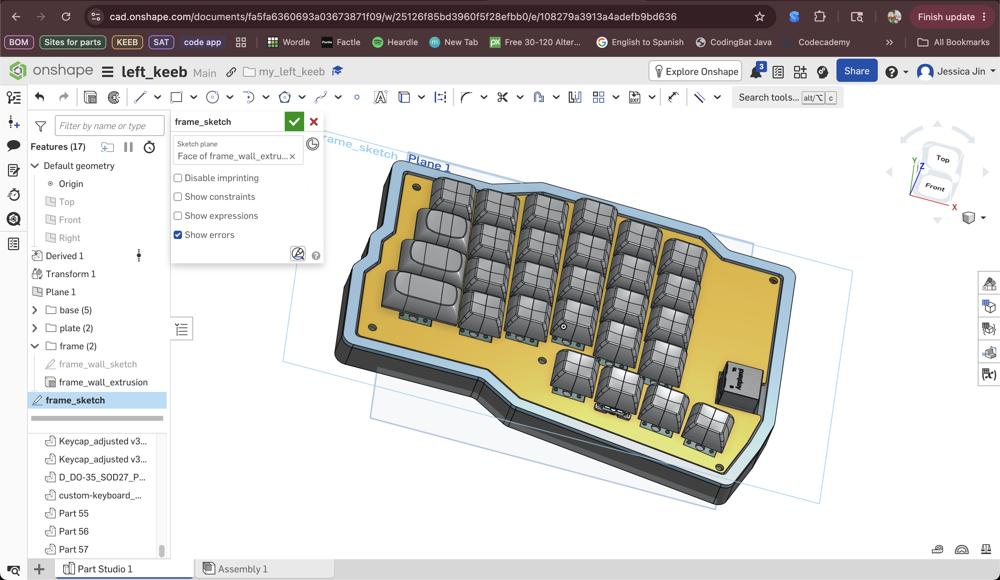
 

## Section 6: Writing the Firmware in QMK (4 hours)
I thought this section might take a long time as well, but surprisingly, I finished writing the firmware pretty quickly. I'll definitely have to troubleshoot it when I actually get my board, but I do at least have a base to start with.

The most difficult part of writing the firmware was integrating QMK into VSCode. For some reason, the keymaps.c file kept giving errors when they weren't supposed to because VSCode didn't recognize the syntax. Somehow, I managed to get my files to work, I'm honestly still not sure what exactly was the problem. I think the extensions I installed for QMK might've been clashing with VSCodes's native syntax checker.

 

Anyways, I made my project under the Lily58 directory because their keyboard seemed the most similar to mine. They used a json instead of a c file for their keymap however, so I had to look up some tutorials and other keyboards to write mine in C. This guide (https://vikasraj.dev/blog/qmk-pi-pico-rp2040) and the QMK docs were also extremely helpful for coding the connection between split keyboards with RP2040. I spent a lot of time reading the docs to understand how the info.json, layouts.h, and keymaps worked in relation to each other.

Info.json in progress:

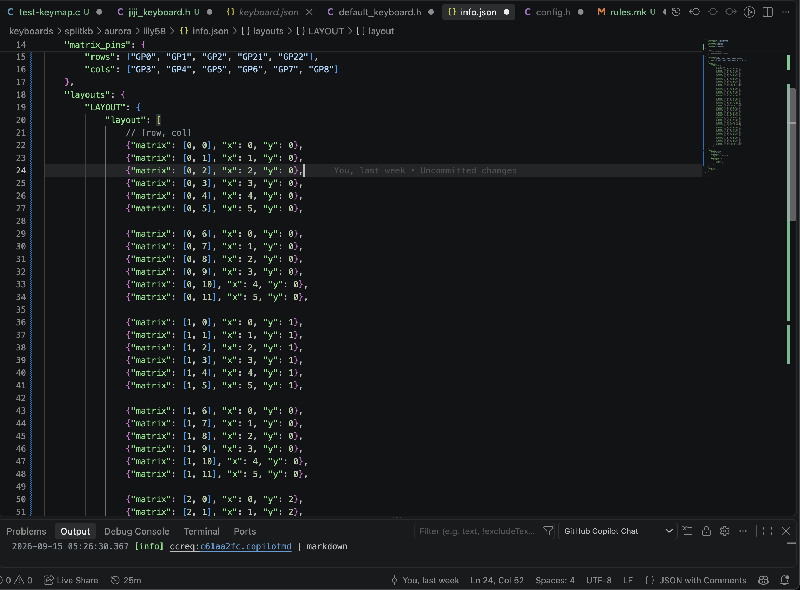
 
keyboard.h in progress:

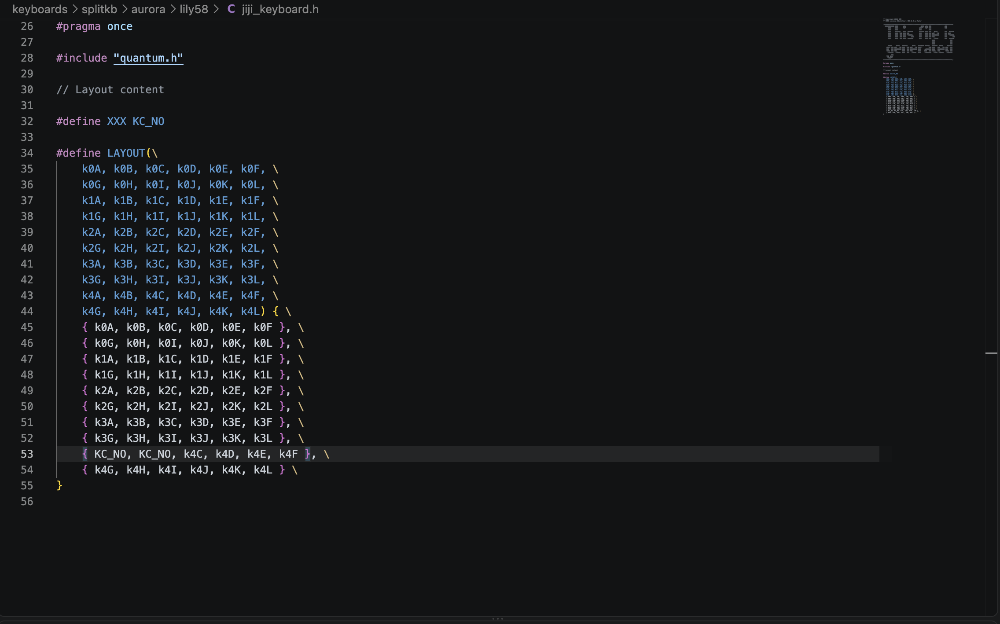
 

Planning the layers I wanted for my keyboard was pretty fun. I was pretty ambitious in what I wanted my keyboard to be capable of so hopefully they will be useful when I flash my PCB and actually make use of the layers.

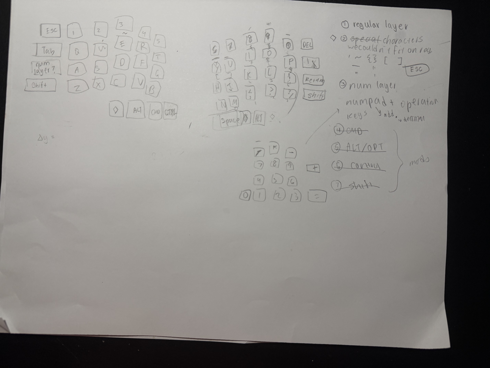
 
Making the keymaps:
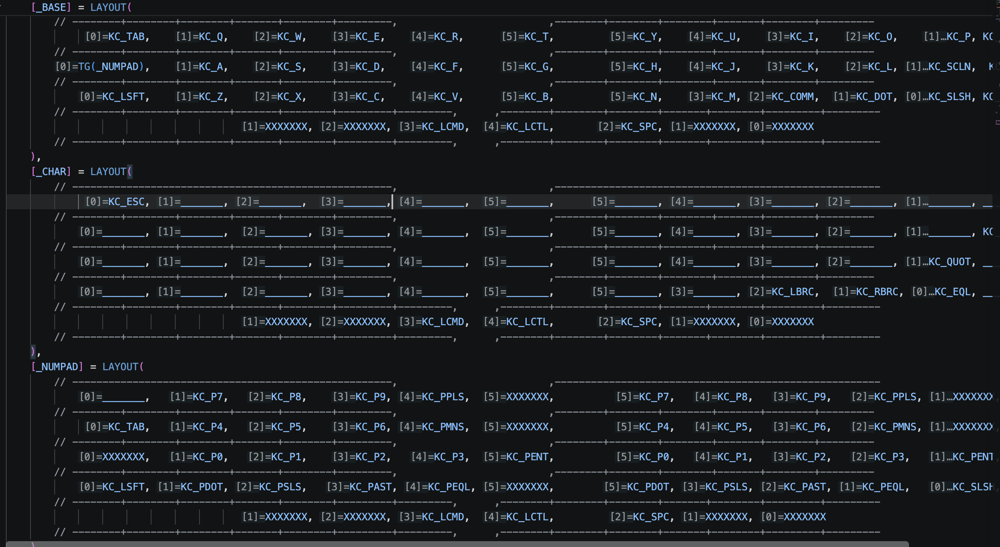

## Section 7: Finalizing for Submission (3 hours)

I made the BOM and README all at once since I was in a bit of a time crunch (the program ends very soon at the time I'm writing this).

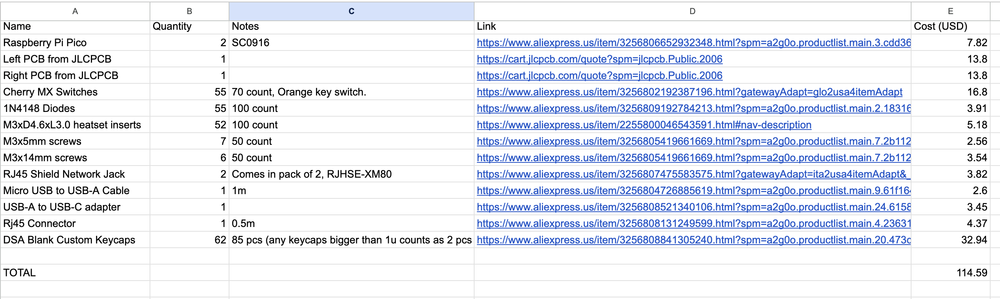
 

**Finally submitted!!**

